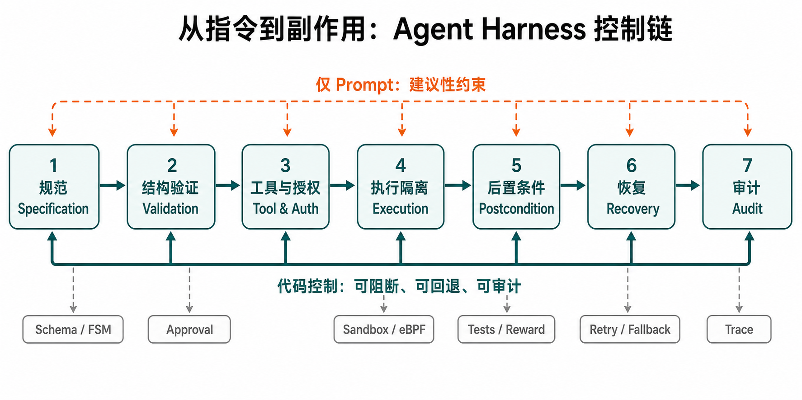
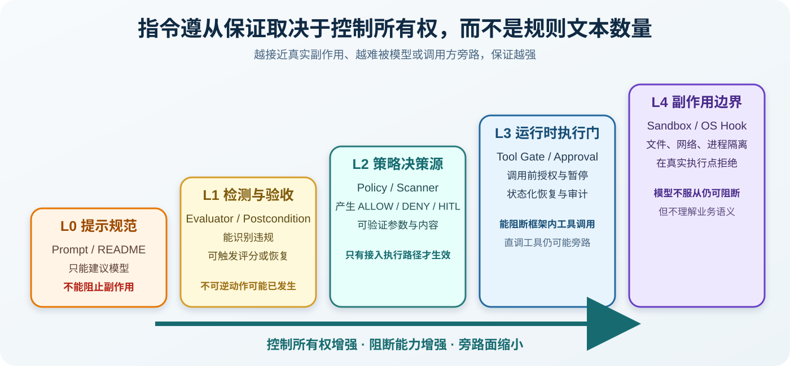

# Agent 指令不遵从的论文定义与 Harness 代码级实现

## 最终综合报告：文献定义、证据边界与实现取证

**资料核验基准：** 2026-08-20；报告修订：2026-08-23（Asia/Shanghai） 
**材料范围：** 《相关工作.pptx》相关研究、16 篇补充论文，共 27 份本地论文材料，以及当前仓库中固定提交的源码与测试 
**报告目录：** [reports 编号与内容说明](00_报告目录与编号说明.md) 
**证据入口：** [原始综合报告](03_初始文献与代码证据综合报告.md)、[补充系统综述](06_补充性系统映射与代码证据综合报告.md)、[既有代码矩阵](01_代码级证据矩阵.md)、[主仓库清单](../sources/repo_manifest.md)、[补充仓库清单](../repos/supplement/manifest.json)

## 摘要

本报告回答两个相互依赖的问题：论文究竟把 agent 的“指令不遵从”定义成什么，以及当前证据集中有哪些 harness 以代码而非提示词改变了这些不遵从行为。对 27 份本地论文材料的主题综合表明，不遵从不能缩成“最终回答不像用户要求”：它至少覆盖原子输出、条件与多约束、结构化输出、动作安全、时序状态、最小权限、来源与信息流、执行保真、资源边界以及合同稳定性与恢复 10 类性质。前七类大多可回溯到论文明确术语或形式化判据；“终态统一定义”和“恢复不遵从”则是本报告跨论文综合，不能伪称为单篇论文原话。在此口径下，逐仓库核验得到 21 个具有运行时控制、策略决策、工具审批、信息流、隔离或恢复代码的实现，另有 2 个检测/后置验收实现。代码证据进一步表明，论文中的检测指标只有在真实副作用之前进入不可绕过的执行门、异常语义明确、状态持久化且恢复仍受策略约束时，才会从“可测量的不遵从”升级为“可阻止的不遵从”。

*图 1　指令遵从应被实现为完整调解。模型负责提出意图、计划和工具调用；harness 负责解析、能力与信息流判断、执行前 gate、隔离、后置条件、审计和受策略约束的恢复。该图是概念综合，不包含经验计数。*

## 1. 口径与证据规则

本报告把“代码级实现”定义为能在固定 Git 提交中定位到可执行控制路径的项目。控制路径至少要读取 agent 的消息、计划、工具、参数、状态或结果，并产生验证、变换、暂停、拒绝、隔离、恢复或审计效果。只存在 system prompt、README 架构图或论文描述的项目不计为代码实现；只在运行后评分的 checker 被单列为检测型实现，不与执行前 gate 合并。

证据等级沿用此前报告。E0 表示只有文档或提示声称，E1 表示存在可定位的实现路径，E2 表示存在针对性测试，E3 表示有对照、消融或行为测量，E4 表示独立复现或生产证据。等级描述的是本轮实际取得的证据，不是项目知名度。表中提交均为本地固定提交的唯一短哈希，完整 40 位提交、remote 和检出状态见仓库清单。

*图 2　Agent harness 的控制生命周期。提示规范可以覆盖所有阶段，但只有代码所有的 validation、authorization、execution、postcondition、recovery 和 audit 路径能够独立于模型服从而改变行为。*

*图 3　保证阶梯。检测器和策略决策源是必要组件，但它们只有被接入不可绕过的执行路径时才成为强制控制；系统级副作用边界最难被模型绕过，却仍需上层业务语义。*

## 2. 论文中的“指令不遵从”定义体系

前一版最终报告把论文主要当作仓库来源和机制背景，重点落在“代码在哪里改变执行”，因而确实没有充分呈现论文怎样界定不遵从。本次修订把两层证据分开：论文层回答哪些行为算违反指令，代码层回答系统能否在副作用发生前检测、阻断或恢复。两者不能互相替代；论文报告的高安全率不能自动证明本地仓库实现完整，代码中存在一个 `deny` 分支也不能证明它覆盖了论文威胁模型。

设 `I` 为用户指令、系统政策和工具规格的集合，`H_t` 为时刻 `t` 之前的轨迹，`a_t=(tool,args,target)` 为候选动作，`E_t` 为环境状态，`o_t` 为模型输出。本文把一次轨迹视为遵从，当且仅当输出、语义、工具、授权、信息流、时序、环境变化、终态和恢复对应的判据同时成立。因而，“指令不遵从”可以操作化为至少一个判据在某一步为假，而不是只检查最终文本。这个统一谓词体系是对下列论文的综合，不是任何单篇论文原封不动提出的术语表。

### 2.1 从可验证输出到完整执行轨迹

IFEval 把复杂请求拆成可由确定性函数检查的原子指令，并区分 strict 与 loose 评测；它清楚界定了“输出是否满足约束”，但没有工具副作用。AGENTIF 进一步从真实 agent 应用中提取格式、语义和工具三类约束，并加入条件、示例和 meta constraint 表达形式，说明长指令中的不遵从往往是多约束组合失败，而不是单个格式错误。Structured Output Control 与 JSONSchemaBench 又表明，语法合法、结构满足 schema 和值语义正确是三个不同层次；合法 JSON 仍可能携带错误参数或错误业务值。

动作型论文把判定点向执行前移动。AgentSpec 和 ShieldAgent 将“候选动作是否满足安全规则”定义为运行时谓词；Progent 和 PFI 把越过最小权限、未经批准扩权或让低完整性内容触发特权操作视为违规；CaMeL 与 Fides 则通过控制流、数据流、capability、confidentiality 和 integrity 标签刻画不可信数据如何影响动作。Agent-C 证明单步合法仍不足够，因为调用顺序、历史状态和跨步不变量也可能被违反。HarnessAudit 最后把观察范围扩到完整轨迹，分别检查 boundary compliance、execution fidelity 和 system stability。

### 2.2 十类可操作的不遵从定义

| ID 与定义 | 操作化违规判据 | 论文证据（本地 PDF） | Harness 对应机制与边界 |
|---|---|---|---|
| **U1 原子可验证输出不遵从**（论文明确） | 任一原子指令的确定性检查为假；strict 口径要求同一提示中的所有检查同时通过。 | [IFEval](../papers/ifeval_2023.pdf)，§2.1-2.2，PDF pp.2、4-5。 | 确定性 checker、输出 parser、重试和 postcondition。它能测量结果，但不能撤销已发生的工具副作用。 |
| **U2 条件、多约束与工具规格不遵从**（论文明确） | 条件触发后约束失败，或出现禁用工具、遗漏必需工具、错误工具名、参数类型/格式错误；ISR 可通过而整体 CSR 仍失败。 | [AGENTIF](../papers/agentif_2025.pdf)，§3.1-3.4，PDF pp.2-7；§4.3，pp.7-8。 | 条件求值器、逐约束 verdict、工具 registry 和参数 schema；需要明确约束合取与优先级。 |
| **U3 结构化输出不遵从**（论文明确） | 解析失败属于 syntax error；schema 或函数签名不匹配属于 structural error；值、参数或业务逻辑错误属于 value error；schema 还可能过约束或欠约束。 | [Structured Output Control](../papers/structured_output_control_se_2026.pdf)，§2.2，PDF pp.7-8；[JSONSchemaBench](../papers/jsonschemabench_2025.pdf)，§5，pp.7-8。 | grammar/schema compiler、parser 与语义 validator 必须分层；“可解析”不能替代“可执行且正确”。 |
| **U4 动作安全规则不遵从**（论文明确） | 在 trigger 命中后，安全 predicate 判定候选动作不安全，执行器仍让动作发生；或策略规则前件成立而禁止动作被执行。 | [AgentSpec](../papers/supplement/agentspec_icse_2026.pdf)，§2.3、§3，PDF pp.4-6；[ShieldAgent](../papers/supplement/shieldagent_icml_2025.pdf)，§3。 | 执行前 gate、规则引擎、STOP/ASK/SELF-EXAMINE 和 verifier；自然语言到规则的漏编译仍是独立风险。 |
| **U5 时序与状态不遵从**（论文明确） | 把候选动作追加到 `H_t` 后，使 temporal/FOL/SMT 规范不可满足；例如未认证先访问、未批准先付款、一次性授权重复使用。 | [Agent-C](../papers/supplement/agent_c_2025.pdf)，§2，PDF pp.3-5；§4，pp.7-12。 | 持久化状态、时序监控、SMT 检查、回溯或重采样；只检查当前 tool call 无法发现此类违规。 |
| **U6 最小权限与能力升级不遵从**（论文明确） | 工具、参数、目标或权限范围超出当前 least-privilege policy，或能力未经可信审批被扩大；低权限主体执行 privileged action。 | [Progent](../papers/supplement/progent_2025.pdf)，§4，PDF pp.4-6；[PFI](../papers/supplement/pfi_2025.pdf)，§3.2、§4，pp.3-8。 | capability token、参数级 allowlist、monotonic confinement、扩权审批和身份绑定；工具名级批准过于粗糙。 |
| **U7 来源、控制流与信息流不遵从**（论文明确） | 不可信数据改变特权控制流，不满足 integrity noninterference，或机密数据流向未授权 sink；“内容在上下文中”不产生权限。 | [CaMeL](../papers/supplement/camel_2025.pdf)，§3-4，PDF pp.4-6；[Fides](../papers/supplement/fides_ifc_2025.pdf)，§4.1-4.4，pp.6-8；PFI §3.2.2。 | provenance/taint/IFC 标签、trusted/quarantined 组件、capability 与 sink authorization；标签传播遗漏会形成隐式流旁路。 |
| **U8 终态、检查点与执行保真不遵从**（论文概念 + 本文综合） | 中间动作、目标对象、参数、必要 checkpoint 或最终环境状态不满足任务；模型声称成功但没有环境证据。 | [HarnessAudit](../papers/supplement/harnessaudit_2026.pdf)，§3.2 的 L2 Execution Fidelity，PDF pp.4-5；AgentDojo 与 τ-bench 提供后置 oracle。 | 环境 oracle、状态快照、checkpoint 和 postcondition checker；“终态不遵从”作为统一名称是本文跨论文归纳。 |
| **U9 边界、资源、角色与通信不遵从**（论文概念 + 本文综合） | 使用未授权或与任务无关的工具，访问越界资源，超越角色权限，或发生禁止的跨 agent/app 通信与数据转发。 | HarnessAudit §3.2 的 L1 Boundary Compliance，PDF pp.4-5；[IsolateGPT](../papers/supplement/isolategpt_ndss_2025.pdf)，摘要与 §I-II；PFI §4。 | action sink、资源 scope、角色策略、hub-spoke mediation、sandbox 与通信 PEP；未进入受控 sink 的调用仍可绕过。 |
| **U10 合同、稳定性与恢复不遵从**（跨论文综合） | 在 prompt injection、模型替换、歧义目标、工具错误、重试或恢复时，代码拥有的 contract、边界或安全后置条件不能保持。 | [From Prompts to Contracts](../papers/prompts_to_contracts_2026.pdf)，§3.6、§5.1、§5.5，PDF pp.8、12-18；HarnessAudit L3；[ToolSafe](../papers/supplement/toolsafe_acl_2026.pdf)，§3-4。 | deterministic fallback、bounded retry/replan、rollback/compensation、trace 和扰动回归测试；统一的“恢复不遵从”是本文综合术语。 |

### 2.3 哪些定义来自论文，哪些是本报告综合

U1-U7 的核心术语能够直接回到论文：IFEval 的 verifiable instruction 与 strict/loose accuracy，AGENTIF 的 format/semantic/tool constraint 和 CSR/ISR，Structured Output 的三层错误，AgentSpec 的 trigger/predicate/enforcement，Agent-C 的时序规范与 SMT 可满足性，Progent 的 symbolic privilege policy，CaMeL/Fides/PFI 的 capability、完整性和机密性性质。HarnessAudit 也明确提出 L1 Boundary Compliance、L2 Execution Fidelity 和 L3 System Stability。

U8-U10 的统一名称和 U1-U10 的总分类是本报告的跨论文综合。特别是，日志缺失通常意味着“无法证明合规”，而不是已经证明 agent 违规；同样，论文中的检测分数、攻击成功率或规则符合率不等于本地实现具备不可绕过的阻断能力。为避免证据升级错误，后续代码表仍分别标注论文行为证据和本地实现证据。

### 2.4 从论文定义到 harness 责任

评价型论文主要提供可观察判据：IFEval、AGENTIF、JSONSchemaBench 和 Structured Output Control 能说明结果哪里错，却不拥有执行器。策略和信息流论文把判据变成状态：AgentSpec、Progent、CaMeL、Fides、PFI、Agent-C 和 MCP PEP 分别持有规则、权限、标签或历史。系统与生产论文进一步强调调解位置：ActPlane 把边界下沉到内核副作用，From Prompts to Contracts 把 fallback 和验证迁入 code-owned contract，Measuring Agents in Production 则观察到生产团队依靠 bounded workflow、环境约束和人工验证来控制可靠性。

因此，论文定义和代码机制应建立一一对应：U1-U3 主要需要 parser、schema 与 semantic validator；U4-U7 需要执行前 policy/capability/IFC gate；U5、U8 和 U10 需要持久状态、环境 oracle 与受约束恢复；U9 还要求 sandbox、资源中介或内核边界。若某实现只返回 scanner verdict 而调用方可以忽略，它至多覆盖“检测”；只有该 verdict 支配后续动作时，才能声称实现了相应定义的“防止”。

## 3. 当前代码级实现总览

当前 21 个实现可以分成三类。第一类直接支配工具调用或副作用，具有较清楚的阻断语义。第二类提供策略、信息流、审批、扫描或 validator，但保证依赖宿主接线、配置和默认值。第三类在执行后检测结果或轨迹，它们能够给出合规证据，却通常不能撤销已经发生的副作用。这个分类比项目自称“guardrail”“firewall”或“harness”更重要，因为同一个名称可能对应完全不同的执行所有权。

### 3.1 直接在线强制与代码所有的恢复

| 实现（固定提交） | 实现机制 | 具体代码证据 | 执行语义、边界与等级 |
|---|---|---|---|
| **ActPlane** (`47cd96c`) | Linux eBPF/LSM 副作用拦截、权限策略 | `policies/readonly.yaml:7-12`；`bpf/process.bpf.c:1763-1780,2413-2449`；`script/e2e_examples.sh:107-160`；`test/e2e_cases.yaml:137-144` | 规则命中后在文件、网络或进程副作用点返回 `-EPERM` 或发送 `SIGKILL`，无匹配 `rid<0` 时放行。边界是 Linux/eBPF 环境和已挂载 hook；hook 外 API 可绕过，KILL 也可能晚于部分副作用。**E2，论文测量 E3**。 |
| **Microsoft Agent Governance Toolkit** (`81955d4`) | 策略求值、verdict 正规化、人工审批、审计链 | `agent-governance-typescript/src/policy.ts:450-551`；`policy-engine/core/src/runtime.rs:160,337`；`policy-engine/core/src/verdict.rs:100,229`；`tests/e2e_python/scenarios/human_approval/test_human_approval.py:74-101`；`agent-governance-typescript/src/audit.ts:14-95` | 无匹配和后端错误默认 deny，审批拒绝不执行；`warn/log` verdict 仍 permit，extractor 异常会被吞掉。端到端测试覆盖批准后恰好执行一次、拒绝后不执行；绕过 dispatcher 的工具仍无保护。**E2**。 |
| **Enterprise LLM Agent Harness** (`e8e60fb`) | 合同、结构验证、确定性 fallback、消融对照 | `server/index.mjs:1020-1164`；`server/guardrail.mjs:30-55`；`tests/harness.test.mjs:104-135`；`tests/guardrail-scorer.test.mjs:93-150`；`scripts/build-claim-promotion-review-packet.mjs` | prompt-only 分支会记录失败却返回原输出，code-owned 分支在验证失败时进入确定性 composer；external guardrail 只有 pass/redact/refuse。论文与测试比较三条路径；本地 guardrail 子集 23/23 通过，全量 25/34 通过。**E3，但非完整独立复现**。 |
| **OpenAI Agents Python** (`5250cb8`) | strict schema、工具输入/输出 guardrail、审批暂停与恢复 | `src/agents/function_schema.py:23,473`；`src/agents/tool.py:417-420,441,480,483,486,595`；`src/agents/run_internal/tool_execution.py:1785-1838,1858-1990`；`tests/test_run_impl_resume_paths.py:421-460`；`tests/test_hitl_session_scenario.py:128-180` | pending approval 不执行，批准后恢复，拒绝返回 rejection；guardrail 可 reject 或 raise。源码明确警告直接包装 callable 可绕过 schema、guardrail、timeout 和 tracing，`needs_approval=False` 也可显式关闭审批。**E2**。 |
| **NVIDIA NeMo Guardrails** (`1c657ca`) | 输入/输出 rail、工具调用与工具结果验证 | `nemoguardrails/guardrails/rails_manager.py:327-429`；`nemoguardrails/guardrails/actions/tool_call_action.py:38-59`；`nemoguardrails/guardrails/actions/tool_result_action.py:50-162`；`nemoguardrails/guardrails/tool_rail_action.py:37-63`；`tests/guardrails/test_tool_call_action.py:34-71`；`tests/guardrails/test_rails_manager.py:781-900` | malformed tool call、非法参数和普通 rail 异常被判为不安全，HTTP 状态异常会 re-raise；无 active rail、`enabled=False`、空调用或空结果 pass。真实工具由 client harness 执行，因此绕过 manager 或关闭 rail 会失去保护。**E2**。 |

这五个实现的共同点是，控制代码不只生成“建议”，而是能够决定执行是否发生或决定失败后的输出。ActPlane 最接近不可绕过的副作用边界；其余实现主要保护通过指定 dispatcher、tool wrapper 或 rail manager 的调用。因而，所谓“完整调解”不是项目拥有策略类即可，而是所有产生副作用的入口都必须通过同一个决策点。

### 3.2 论文实现中的策略、能力、信息流和工具 gate

| 实现（固定提交） | 实现机制 | 具体代码证据 | 执行语义、边界与等级 |
|---|---|---|---|
| **AgentSpec** (`e6fa390`) | 可执行规则、工具前 gate、HITL、self-reflect | `src/controlled_agent_excector.py:82-99,164`；`src/enforcement.py:31-85`；`src/interpreter.py:112-139` | action loop 可执行 `CONTINUE/SKIP/STOP/SELF_REFLECT`。解析错误或 `rules=None` 可阻断，但无匹配规则时 pass-through；直接调用工具可绕过 executor。**E1**。 |
| **CaMeL** (`f083b6b`) | privileged/quarantined 模型分离、信息流和工具策略 | `src/camel/security_policy.py:58-110`；`src/camel/interpreter/interpreter.py:2048-2065`；`src/camel/pipeline_elements/privileged_llm.py:459-474` | 默认策略在私有数据流向有副作用工具或无匹配规则时拒绝；`NoSecurityPolicyEngine` 永久允许。只保护 CaMeL interpreter 路径，metadata/source 分类依赖适配器。**E1 代码，论文行为测量可达 E3**。 |
| **Fides** (`669c046`) | 动态 taint、信息流标签、策略异常 | `Tutorial.ipynb:1483,1495-1519,1533`；未知工具检查见同 notebook `:237-253` | `LabeledPlanningLoop` 在工具执行前调用 policy，违规抛 `PolicyViolation`，结果标签与当前标签 join。证据只有 notebook，早期 `BasicPlanner` 可绕过 labeled loop。**E1 原型**。 |
| **PFI** (`73ee2b5`) | prompt-flow integrity、trusted/untrusted 数据流、HITL | `pfi_agent/pfi_agent_creation.py:55-67,228-296,1014-1080`；`config.py:5-21`；`pfi_tools.py:70-117` | 未知或反序列化失败的数据降级为 untrusted；unsafe flow 可选择 NO/HUMAN/YES，但默认 `UNSAFE_DATAFLOW_YES` 是 fail-open。条件代码 `exec` 失败还会回退 LLM。**E1 代码，论文测量 E3**。 |
| **CUGA / Governance by Construction** (`8b45234`) | `TOOL_APPROVAL`、`BLOCK_INTENT`、`MODIFY_TOOLS`、tool guard | `src/cuga/backend/cuga_graph/policy/models.py:9-31,279-307`；`src/cuga/backend/cuga_graph/policy/enactment.py:32-120,228-233`；`src/cuga/backend/cuga_graph/policy/tool_guard/tool_guard_runtime.py:761-874`；`src/cuga/backend/cuga_graph/policy/tests/test_e2e_intent_guard.py:25-31,127-133`；`tests/unit/test_tool_guard_generation.py:118-134` | 已声明 guard 的违规与部分内部错误会阻断；默认 `enable_policies=False`，顶层 `PolicyEnactment` catch-all 会记录 “continuing without policies”，未初始化、无 guard 或 `target_apps` 不匹配也可放行。**E2**。 |
| **Tool Forge** (`07947e9`) | validation-carrying tool card、session allowlist、容器沙箱、审计 | `tool_generator/tool_card_schema.py:318-383`；`tool_generator/tool_router.py:423-572,682-704,998-1024`；`tool_generator/container_sandbox.py:13-50`；`tests/test_tool_router.py:143-176`；`tests/test_container_sandbox.py:6-37` | card、release、session 和 sandbox 错误多为 closed，并写入 JSONL 审计；`include_unpublished=True`、动态 import 和默认 local-owner 认证是部署边界。**E2**。 |
| **MCP PEP Agent Security** (`3dd9690`) | policy-enforcement point、capability token、IFC、hash-chain audit | `prototype/pep/enforcer.py:103-306`；`prototype/pep/rules.py:27-85,134-165`；`prototype/audit/logger.py:68-172`；`prototype/agent_runner.py:346-371`；`prototype/tests/test_intent_taint.py:110-169`；`prototype/tests/test_filesystem_prefix.py:43-89` | 只有 ALLOW 才执行，token、调用次数和 DENY 为 closed；无规则匹配默认 allow，`skip_pep` 是显式 baseline bypass，`REQUIRE_CONFIRM` 没有真正的人类审批 UI。本地 42 项测试中 39 项通过，其余为 Windows symlink 权限和 POSIX 路径假设。**E2 原型**。 |
| **AgentGuard** (`20d4af5`) | 多阶段 enforcer、框架 adapter、远程/本地策略 | `src/client/python/agentguard/u_guard/enforcer.py:29,59,95-111,136-148`；`src/client/python/agentguard/compat.py:45,57,96-100`；`tests/test_attach_adapters.py:779,833` | adapter 接入后可执行策略；远程不可用可配置 `fail_open`，没有远程或最终本地决策时存在 allow 路径。未 attach 或直接调用工具可绕过。**E2**。 |

这一组说明“内容不是权限”。AgentSpec 把规则编译为 action-loop 决策，CaMeL、Fides 与 PFI 跟踪数据来源，MCP PEP 使用 capability token 与信息流标签，Tool Forge 把验证信息附着到工具发布和调用链。它们的主要风险不是没有策略，而是策略覆盖面不完整、默认值偏 open，或者宿主可以从未经过 gate 的路径直接调用工具。

### 3.3 SDK、策略决策源、审批与输出 validator

| 实现（固定提交） | 实现机制 | 具体代码证据 | 执行语义、边界与等级 |
|---|---|---|---|
| **Google ADK Python** (`c986ff0`) | `FunctionTool` confirmation、before/after/error plugin callbacks | `src/google/adk/tools/function_tool.py:99-142,291-353`；`src/google/adk/plugins/base_plugin.py:297,321,348`；`src/google/adk/flows/llm_flows/functions.py:783-947`；`tests/unittests/tools/test_tool_confirmation.py:17-33` | `require_confirmation=True` 且未确认时不执行；默认值是 `False`。原始 callable、非 `FunctionTool` 或未经过 plugin 生命周期的路径是旁路，live path 还留有 confirmation 恢复 TODO。**E2**。 |
| **Microsoft Agent Framework** (`435201b`) | session-backed 工具审批 middleware、AG-UI resume、standing rule | `python/packages/core/agent_framework/_harness/_tool_approval.py:343,355-413,504-640`；`python/packages/core/tests/core/test_harness_tool_approval.py:708,929,1161,1368` | approval state、排队请求和响应持久化在 session；middleware 是 opt-in。按工具名的 auto-approval 可能误批准同名工具，直接绕过 middleware 不受控。**E2**。 |
| **PydanticAI** (`97f2114`) | deferred tool execution、`ApprovalRequired`、恢复 | **Git object 证据：**`docs/deferred-tools.md:25-29,65-72,101-106`；`pydantic_ai_slim/pydantic_ai/tools.py:306,333,431,506`；`pydantic_ai_slim/pydantic_ai/_deferred.py:27,44,100,110,155,181-187`；`tests/test_tools.py:1671-1683,1762-1782` | `requires_approval=True` 时工具 deferred，等待 `DeferredToolResults`；默认 `False`。官方文档警告不可信客户端可伪造 history/approval，敏感工具仍须内部鉴权。工作树因 TLS 中断为空，本轮只以 immutable HEAD object 为证。**E2 源码/测试存在，未本地运行**。 |
| **Guardrails AI** (`c472d55`) | 输入/输出 validator、reask/fix/filter/refrain/exception | `guardrails/guard.py:86,252-272,485-510,680-690`；`guardrails/validator_base.py:102-155,206`；`guardrails/types/on_fail.py:6-31` | `Validator(on_fail=None)` 默认映射为 `EXCEPTION`，可 fail-closed；Pydantic schema 等入口也可能把缺省动作映射为 `NOOP`。直接调用 provider 或工具、绕过 `Guard` 时无保护。**E1-E2**。 |
| **Invariant** (`2340fe2`) | policy DSL、trace analyzer、`Monitor` 包装执行 | `invariant/analyzer/policy.py:23,77-90,121-126`；`invariant/analyzer/monitor.py:78,141-175`；`invariant/tests/analyzer/test_guarding.py:26,63` | `LocalPolicy.analyze` 只返回分析结果，调用方忽略即 open；`Monitor.run` 对未处理违规抛错。当前固定提交不能外推为完整 Gateway。**E2**。 |
| **Agent Policy Guard** (`6702e0b`) | YAML policy-as-code、`allow/deny/ask/hitl` effect | `python/src/agent_policy_guard/models.py:10-37,93-120`；`python/src/agent_policy_guard/engine.py:54,117-161`；`python/tests/test_guard.py:21-37,252-312,494-509` | 默认无匹配 effect 是 `ask`，engine 的 `resolve` 只返回 effect 字符串。宿主若不 dispatch verdict，策略不会阻止工具。本地运行因缺少 pytest 未执行。**E2 源码/测试存在**。 |
| **LlamaFirewall** (`e36f132`) | 多 scanner 聚合、BLOCK/HITL、replay scan、CodeShield | `LlamaFirewall/src/llamafirewall/llamafirewall.py:108-187`；`LlamaFirewall/src/llamafirewall/scanners/regex_scanner.py:78-95`；`LlamaFirewall/src/llamafirewall/scanners/experimental/alignmentcheck_scanner.py:74-91,113-130`；`CodeShield/codeshield.py:64-95`；`LlamaFirewall/tests/test_replay_scan.py:101-211` | BLOCK/HITL 会让 scanner pipeline 短路；空 scanner、缺 trace 和部分 `ALLOW+ERROR` 路径为 open，CodeShield 异常返回 `IGNORE`。HITL 是 signal，不是内置审批系统，调用方必须据此停止执行。**E2**。 |
| **ToolSafe** (`46358fa`) | proactive step-level guardrail、alignment firewall、反馈重规划 | `src/agent/sec_react_agent.py:73-124`；`src/agent/react_firewall_agent.py:70-103`；`src/utils/tool_parser.py:17-54` | alignment=false 时不执行工具；sec-react 把风险反馈给模型并依赖模型重规划，属于软阻断。只覆盖 `known_actions` 和特定 parser，JSON fallback 与外层异常偏 open。**E1 代码，论文测量 E3**。 |

这一组不能被笼统写成“已经强制执行”。Google ADK、Microsoft Agent Framework 和 PydanticAI 有明确的暂停/恢复语义，但都需要调用方选择受控工具类型或安装 middleware。Invariant、Agent Policy Guard、Guardrails AI 和 LlamaFirewall 可以产生错误、effect 或 verdict；若宿主忽略结果，它们只是决策源。ToolSafe 的一条路径甚至把风险重新放回模型上下文，保证强度明显弱于确定性拒绝。

## 4. 检测与后置验收型代码实现

除上述 21 个运行时或决策层实现外，当前证据集中还有两个与 harness 指令遵从直接相关、但主要在执行后工作的代码实现。它们应被保留，因为 postcondition 和 trace audit 是完整闭环的一部分；它们也必须被单独标记，因为检测失败不能自动撤销邮件、支付、删除或外部 API 调用。

| 实现（固定提交） | 具体代码证据 | 能做什么 | 不能做什么与等级 |
|---|---|---|---|
| **AgentDojo** (`089ed46`) | `src/agentdojo/functions_runtime.py:246-310`；`src/agentdojo/agent_pipeline/pi_detector.py:98-113`；`src/agentdojo/base_tasks.py:18-125`；`src/agentdojo/benchmark.py:361-376`；`tests/test_functions_runtime/test_functions_runtime.py:391-415` | 未注册工具和非法参数可被 runtime 识别；注入 detector 显式配置时可 abort；utility/security checker 对终态给出结果。 | 默认 `raise_on_error=False` 会把工具错误作为模型可见 observation 后继续，注入 detector 默认转换内容而非阻断；核心仍是 benchmark/oracle。**E2 runtime，注入阻断 E1**。 |
| **HarnessAudit** (`6317162`) | `multi_agent/schemas/access_rules.py:1-4,94-105,158-180`；`multi_agent/checker.py:116-137,172-178`；`multi_agent/completion_checks.py:85-105,117-251`；`multi_agent/frameworks/core/action_sink.py:50-69,89-169` | 检查工具、资源、通信、数据泄露、SDE native bypass 和完成条件，并通过 action sink 记录 trace。 | 默认无匹配时 allow，completion 失败是评分失败而非运行时阻断；绕过 action sink 的副作用不可见。**E1 代码；论文/benchmark 设计 E3**。 |

JSONSchemaBench、IFEval、AGENTIF、τ-bench 与 τ²-bench 同样含有大量可执行 checker，但本报告没有把它们计入 23 个 harness 相关实现。它们主要测量 JSON 结构、文本约束、任务成功或数据库终态，是评测基础设施而不是部署时控制平面。它们仍然适合成为 harness 的 postcondition test oracle，但不应被写成能够事前授权工具。

## 5. 哪些材料不能声称已有代码级实现

| 材料 | 当前证据状态 | 最终处理 |
|---|---|---|
| **Agent-C / Enforcing Temporal Constraints for LLM Agents** (`70b536a`) | 固定提交只有 README，并明确写明代码将来发布 | 不计代码实现；只保留论文中的时序约束思想。 |
| **TrustAgent** (`b286441`) | Git HEAD 存在，但 Windows 非法冒号文件名导致 322 个 tracked path 无法检出，工作树为 0 文件 | 只能作为论文/README 架构证据，不能据此断言 fail-open/closed。 |
| **Progent、ShieldAgent、IsolateGPT** | 已下载论文，但本轮没有取得可在当前仓库中完整核验的对应实现 | 作为论文机制证据，不计本地代码实现。 |
| **Tangent artifact** | 公开仓库截至核验日无提交、0 tracked files | 不计代码实现或可复现 artifact。 |
| **From Prompts to Templates、testing-practices replication、awesome-agent-harness** | 分别是 prompt 分析、研究复现数据和目录 | 可支持分类或发现，不是运行时 enforcement。 |
| **JSONSchemaBench、IFEval、AGENTIF、τ-bench、τ²-bench** | checker、reward 与 postcondition 代码可核 | 作为评测/验收证据，不计部署时 harness gate。 |

这张反证表是最终结论的一部分。论文有仓库链接不等于仓库已经发布实现，项目名含 “harness” 或 “guardrail” 也不等于它支配真实执行。只有把固定提交、调用路径和副作用所有者连起来，才能避免把架构愿景写成已实现保证。

## 6. 跨实现的代码级结论

### 6.1 完整调解比机制数量更重要

当前实现中最常见的失效不是完全没有 guardrail，而是 guardrail 只覆盖一条调用路径。OpenAI Agents 的直接 callable、AgentSpec 的 executor 外工具调用、CaMeL 的 interpreter 外路径、Google ADK 的非 `FunctionTool`、Microsoft Agent Framework 的 middleware 外路径，以及 Guardrails AI 的 provider 直调，都能让策略失去执行所有权。因此，评估 harness 时应首先枚举所有副作用入口，再证明每个入口都经过同一个 policy-enforcement point。

### 6.2 默认值决定“安装后是否真的受保护”

默认 open 在代码中反复出现：PFI 默认 `UNSAFE_DATAFLOW_YES`，Google ADK 默认 `require_confirmation=False`，PydanticAI 默认 `requires_approval=False`，Agent Policy Guard 在无匹配时返回 `ask` 而不负责 dispatch，CUGA 的顶层异常会继续无策略执行，LlamaFirewall 的空 scanner 默认允许。文档中存在 deny 或 approval 能力并不能说明部署默认安全，必须核对构造函数默认值、无匹配分支和异常分支。

### 6.3 审批是控制流程，不等于最终授权

OpenAI Agents、Google ADK、Microsoft Agent Framework 和 PydanticAI 都实现了暂停、审批和恢复，但审批记录本身仍可能被错误绑定、自动批准或由不可信客户端伪造。可靠部署需要把审批与调用 ID、工具身份、精确参数、主体、session 和过期时间绑定，并在工具内部继续做最终鉴权。只按工具名持久化 standing approval 会扩大同名工具或参数变化的风险。

### 6.4 provenance、capability 和信息流弥补纯内容过滤的不足

CaMeL、Fides、PFI 与 MCP PEP 的共同价值在于，它们不只问一段文本“看起来是否安全”，还问数据来自哪里、工具具有什么能力、信息能否从低可信源流向高影响 sink。该方向比另一个 LLM scanner 更接近安全系统中的权限模型。不过，标签传播、工具 metadata 和 trusted/untrusted 分类本身也必须覆盖所有 adapter，否则遗漏来源会变成新的旁路。

### 6.5 扫描器、validator 和 postcondition 必须支配后续动作

LlamaFirewall、Guardrails AI、Invariant 和 Agent Policy Guard 能产生结构化决策，但它们不天然拥有执行器。HarnessAudit、AgentDojo、IFEval 与 τ-bench 更明确地属于运行后检测。工程上应把检测结果映射成确定的状态转换，例如阻断、请求批准、回滚、隔离、重规划或终止；仅记录 warning、reward 或 trace 不足以实现指令遵从。

### 6.6 最强保证来自分层组合

没有单一实现同时覆盖规范编译、参数级 provenance、跨步时序、所有 provider 路径、可信审批、系统隔离、后置条件和不可截断审计。合理组合是：AgentSpec 或 policy-as-code 负责规范，CaMeL/Fides/PFI/MCP PEP 负责能力与来源，SDK middleware 负责统一工具 gate，ActPlane 或容器 sandbox 约束真实副作用，HarnessAudit/AgentDojo 类 checker 验证终态，再由 hash-chain audit 和受策略约束的 recovery 形成闭环。

## 7. 推荐的实现验收清单

一个 harness 若要声称“以代码实现指令遵从”，至少需要证明五件事。第一，所有工具、外部 API、文件、网络和进程入口都经过统一 gate。第二，规则的无匹配、解析失败、策略服务不可用和超时分支具有明确且经过测试的 fail-open/fail-closed 语义。第三，审批绑定主体、工具、精确参数、调用 ID 和 session，且不把客户端历史当作可信授权。第四，策略状态、来源标签、调用次数和时序约束能跨步持久化。第五，拒绝、批准、执行、结果、恢复和旁路尝试均进入不可静默丢失的审计链。缺少任一项时，应把保证降级为“部分控制”而不是“强制遵从”。

## 8. 可复现性与局限

本报告基于固定提交的静态代码审计、仓库内测试和少量本地测试，而不是对 23 个项目统一安装依赖后的全量动态复现。MCP PEP 的 42 项测试有 39 项通过，其余三项对应 Windows symlink 权限与 POSIX 路径假设；Enterprise harness 的 guardrail 子集通过但全量测试仍有失败；Agent Policy Guard 因本地缺少 pytest 未运行；PydanticAI 只从 immutable Git object 读取；TrustAgent 与 ToolSafe 分别受到 Windows 文件名和大小写碰撞影响。不同论文使用不同任务、模型、威胁模型和指标，证据等级不可被理解为统一排行榜。

补充检索共取得 650 条数据库记录，去重后 546 条，形成 113 条详细评估池，最终纳入 16 篇论文。筛选过程、查询式和排除原因分别保存在检索协议、原始响应与逐条筛选记录中。图 4 展示这一路径，避免把定向雪球补充与数据库命中混成同一分母。

*图 4　补充检索的 PRISMA 风格筛选流程。数字由 `sources/supplement/screening_flow.json` 确定性生成。*

## 9. 最终结论

论文层面，本报告把 agent 指令不遵从操作化为 U1-U10：从原子输出、条件和结构约束，延伸到动作安全、时序状态、最小权限、来源与信息流、执行保真、资源边界以及合同稳定性与恢复。其中 U1-U7 主要继承论文明确概念，U8-U10 的统一命名属于跨论文综合。实现层面，截至 2026-08-20，当前仓库能够点名并给出代码证据的项目共有 21 个运行时/决策层实现，以及 2 个检测/后置验收实现。最成熟的工程模式不是让模型重复规则，而是把这些判据编译为由代码所有的 verdict，并让 verdict 在工具或副作用发生前不可绕过地生效。ActPlane 代表系统级副作用控制，Governance Toolkit、OpenAI Agents、NeMo、Google ADK 和 Microsoft Agent Framework 代表 SDK/middleware 执行门，AgentSpec、CaMeL、Fides、PFI、CUGA 和 MCP PEP 代表规范、capability 与信息流控制，Tool Forge、AgentGuard、PydanticAI、Guardrails AI、Invariant、Agent Policy Guard、LlamaFirewall 和 ToolSafe 提供不同强度的验证、审批、扫描或策略组件，AgentDojo 与 HarnessAudit 则补足终态与轨迹验收。

最需要避免的表述是“项目有 guardrail，所以 agent 会遵从指令”。代码证据支持的更准确结论是：指令遵从是一条由 specification、validation、authorization、execution、postcondition、recovery 和 audit 共同构成的控制链；链中任一阶段由模型或可绕过调用方所有，整体保证就只能按最弱环节降级。

## 附录：本地证据入口

完整论文题名、状态与 PDF 对照见 `sources/paper_index.md` 和 `papers/supplement/manifest.json`；主仓库的 remote、commit 和状态见 `sources/repo_manifest.json`，补充仓库见 `repos/supplement/manifest.json`。原始与补充代码取证分别见 `reports/01_代码级证据矩阵.md` 和 `reports/06_补充性系统映射与代码证据综合报告.md`，测试边界见 `reports/02_本地验证记录.md` 与 `sources/supplement/local_test_results.md`，检索协议和逐条筛选见 `reports/05_补充性系统映射研究协议.md` 与 `sources/supplement/screening_decisions.csv`。
