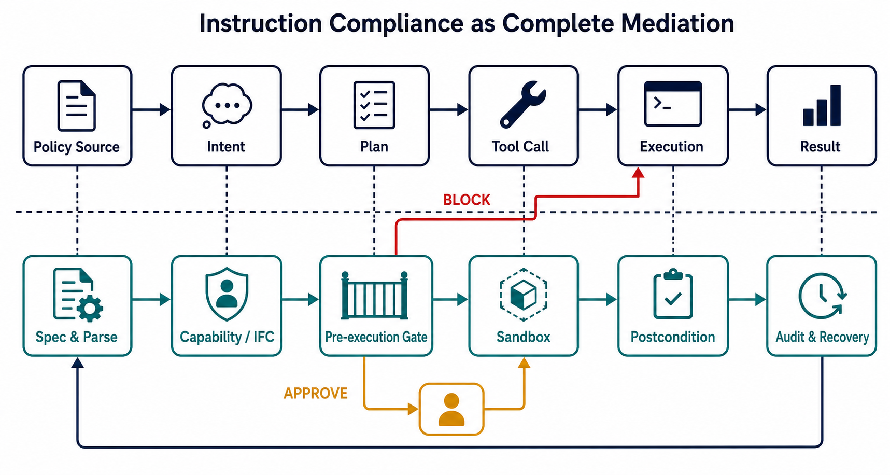
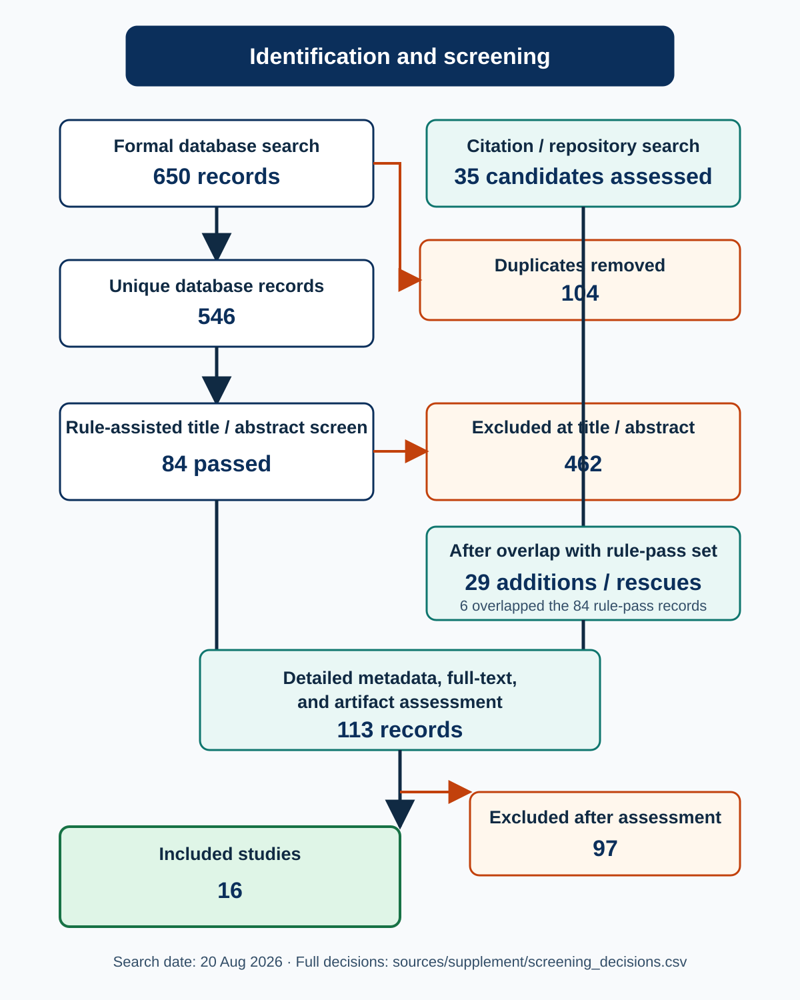

# Agent Harness 如何实现指令遵从：补充性系统映射与代码证据

**检索截止：** 2026-08-20（Asia/Shanghai）  
**范围：** 《相关工作.pptx》已覆盖材料之外的论文和开源实践  
**研究类型：** 补充性系统映射研究（systematic mapping study），参照 PRISMA-ScR 记录流程  
**本地交付：** 16 篇 PDF、18 个固定 commit 仓库、原始检索响应、筛选决定、代码证据与本报告

## 摘要

这轮检索得到的核心结论是：**agent 的“指令遵从”不能只靠更强的 system prompt 或事后检查最终答案；可获得较强保证的实现都把约束变成 harness 拥有的状态，并在工具产生副作用之前完成一次确定性、不可绕过的裁决。**

文献和代码呈现出五个互补层次：

1. **语法与规范层：** 把自然语言政策编译为 Colang、规则 DSL、时序逻辑或工具参数谓词；
2. **权限与来源层：** 用 capability、最小权限、完整性/机密性标签区分“模型知道什么”和“模型有权做什么”；
3. **执行边界层：** 在 tool-call boundary 统一实施 allow / deny / transform / approve；
4. **状态与恢复层：** 约束调用次序、审批状态和失败后的重规划，而不是只判断单步文本；
5. **后置与审计层：** 检查真实环境状态、保存不可抵赖轨迹，并把失败转换为可诊断、可恢复事件。

其中最重要的工程分界不是“是否有 guardrail”，而是：**所有有副作用的路径是否都经过同一个强制执行点；异常、超时、插件缺失和审批恢复时是否仍然 fail-closed。** 本地代码审计发现，多数通用 SDK 的审批/中间件默认是 opt-in；独立 evaluator 即使给出 `deny`，只要 dispatcher 忽略返回值，系统仍会 fail-open。

*图 1. AI 生成的概念图，仅表达本综述的机制综合，不承担实证计数。提示词和验证记录见 `sources/supplement/figure_generation_log.md`。*

## 1. 问题界定

### 1.1 本报告中的“指令遵从”

这里的 instruction compliance 不是单一指标，而是五类性质：

| 性质 | 例子 | 仅靠模型自律是否足够 |
|---|---|---|
| 结构遵从 | JSON、函数名、参数类型合法 | 可由 constrained decoding 提升，但仍需运行时验证 |
| 语义/授权遵从 | 只能向获批收件人发邮件；不得访问越界路径 | 不够，需要权限与参数级策略 |
| 来源/信息流遵从 | 不可信网页不能驱动高权限工具；敏感数据不能流向低可信 sink | 不够，需要 provenance/IFC/capability |
| 时序遵从 | 先认证再读隐私数据；先审批再支付 | 不够，需要跨步状态和时序监控 |
| 完成/后置遵从 | 数据库确实变更为目标状态；失败后不得谎报成功 | 不够，需要环境 oracle、审计与恢复 |

因此，本报告将“只评价回答格式或最终文本”的工作排除在 runtime 核心之外；它们可以是辅助层，但不能证明工具执行合规。

### 1.2 与《相关工作.pptx》的边界

预注册时将 PPT 与现有本地索引中的 11 项设为基线排除集，包括 AGENTIF、IFEval、JSONSchemaBench、ActPlane、Tangent、《From Prompts to Templates》《From Prompts to Contracts》《Testing Practices for OSS AI Agents》《Measuring Agents in Production》及既有 harness 综述等。已有仓库仅在需要建立连续证据时作为参照，不被计入“新增 clone”。

## 2. 方法

### 2.1 预注册问题与纳入标准

正式查询前冻结了四个研究问题：有哪些新增实现；控制位于生命周期何处；fail-open/closed、状态持久性和 bypass surface 如何影响保证；证据停留在文档、实现、测试、行为测量还是生产层。完整协议见 [`supplement_search_protocol.md`](supplement_search_protocol.md)。

纳入项必须同时满足：

- 明确面向 LLM/AI agent 的 runtime、harness、中间件或执行治理；
- 至少支配结构、工具参数、权限、审批、隔离、状态、后置、恢复或审计中的一种；
- 可取得全文或公开 artifact；
- 不在 PPT 基线中；
- 结论可以回到论文正文、固定 commit 或针对性测试，而不只来自博客宣传。

### 2.2 数据源与查询

保存的数据库/API 流包括 OpenAlex、Crossref、arXiv 和 Semantic Scholar；工程流使用 GitHub、官方文档、项目页和正式 venue 页面。Parallel Web CLI 已安装，但本机未认证，`parallel-cli auth` 返回 *Not authenticated*，因此未伪造其结果，改用内置网络检索、数据库 API 与直接主来源核验。Semantic Scholar 只有 q1 成功，q2–q4 返回 HTTP 429；这些错误均保留在原始日志。

四个可复现查询族为：

1. `("LLM agent" OR "language model agent") AND (harness OR guardrail OR middleware OR "policy enforcement") AND ("instruction following" OR compliance OR constraint)`
2. `(agentic OR "AI agent") AND ("tool call" OR "function calling") AND (validation OR approval OR permission OR authorization OR sandbox)`
3. `("LLM agent" OR "AI agent") AND (runtime OR execution) AND (monitor OR contract OR policy OR guardrail)`
4. `("agent workflow" OR "agentic workflow") AND (postcondition OR invariant OR rollback OR recovery OR audit)`

再对高相关种子做题名检索、前后向引用追踪、官方代码仓库追踪和相关项目 issue 检索。完整命令、每个 API 的查询参数和响应保存在 `sources/supplement/run_search.ps1`、`search_raw/` 与 `web_search_log.md`。

### 2.3 检索和筛选结果

正式 API 流取回 650 条：OpenAlex 200、Crossref 200、arXiv 200、Semantic Scholar 50。每个查询最多取 50 条，因此这是 **可复现的截断高召回样本**，不应解读为所有数据库的全集。DOI、arXiv ID 和规范化题名去重后为 546 条；预注册关键词评分阈值 `>=12` 保留 84 条，462 条在题名/摘要阶段排除。

引用/仓库追踪详细评估 35 条，其中 6 条已在 84 条规则通过集中，29 条是新增或被关键词规则漏掉的“救回项”。合并详细元数据、全文与 artifact 评估池为 113 条，纳入 16 篇，排除 97 篇。逐条决定见 `sources/supplement/screening_decisions.csv`。

*图 2. 数字由 `sources/supplement/build_screening_flow.py` 从保存的候选和决定表生成。*

### 2.4 质量与证据等级

报告区分：同行评审论文、预印本、工程实践。代码证据等级为 E0（文档）、E1（实现）、E2（针对性测试）、E3（行为测量/消融）、E4（独立复现或生产证据）。本轮最高可验证层通常是 E1–E3；“项目称用于生产”不自动升级为 E4。

## 3. 纳入论文

| # | 论文与状态 | 主要机制 | 本轮判断 |
|---:|---|---|---|
| 1 | [NeMo Guardrails](https://doi.org/10.18653/v1/2023.emnlp-demo.40)，EMNLP Demo 2023 | Colang；input/dialog/retrieval/execution/output rails | 成熟可编程 runtime；强度取决于 rail 覆盖和异常语义 |
| 2 | [IsolateGPT](https://doi.org/10.14722/ndss.2025.241131)，NDSS 2025 | hub-and-spoke 隔离、权限中介、跨 app 协议 | 说明“隔离+中介”可保持功能；75% 查询额外开销低于 30% |
| 3 | [TrustAgent](https://doi.org/10.18653/v1/2024.findings-emnlp.585)，Findings EMNLP 2024 | pre/in/post-planning 宪法检查 | 有用的模型式基线，但不是确定性授权边界 |
| 4 | [ShieldAgent](https://arxiv.org/abs/2503.22738)，ICML 2025 | policy → probabilistic rule circuits → formal verification | 报告平均领先 11.3%、recall 90.1%；公开 artifact 不足以复核完整 runtime |
| 5 | [AgentSpec](https://arxiv.org/abs/2503.18666)，ICSE 2026 | trigger/predicate/enforcement DSL | 代码 agent 中阻止 >90% 不安全执行；规则生成 recall 仍有限 |
| 6 | [Progent](https://arxiv.org/abs/2504.11703)，预印本 | 工具名/参数权限策略；SMT 判定收缩与扩权 | AgentDojo ASR 39.9%→1.0%，ASB 70.3%→3.9%；扩权必须显式批准 |
| 7 | [Defeating Prompt Injections by Design / CaMeL](https://arxiv.org/abs/2503.18813)，预印本 | 可信意图编译、控制/数据流分离、capability | AgentDojo 中 77% 任务可在可证明安全下完成，对照系统 84% |
| 8 | [Securing AI Agents with IFC / Fides](https://arxiv.org/abs/2505.23643)，预印本 | confidentiality/integrity labels；hide/reveal | 给出可执行性质边界；当前仓库主要是 tutorial，不等于生产实现 |
| 9 | [Prompt Flow Integrity](https://arxiv.org/abs/2503.15547)，预印本 | trusted/untrusted agent 隔离、数据流、最小权限 | Secure Utility Rate：AgentDojo 27.84%→55.67%，AgentBench 2.63%→67.79% |
| 10 | [LlamaFirewall](https://arxiv.org/abs/2505.03574)，预印本 | PromptGuard 2、Alignment Checks、CodeShield、replay/HITL | 多 scanner 组合；模型式 scanner 仍是概率控制 |
| 11 | [Runtime Policy Enforcement for MCP Agents](https://doi.org/10.3390/electronics15132829)，Electronics 2026 | PEP、R01–R05、SI/DS 标签、capability token、哈希审计 | ASR 40%→5%；规则覆盖和数据敏感性盲区仍明显 |
| 12 | [Governance by Construction / CUGA](https://doi.org/10.1145/3786335.3813192)，ACM CAIS 2026 | Intent Guard、Playbook、Tool Guide、Approval、Output Formatter | 企业治理链最完整；政策加入同时提高两个任务集成功率 |
| 13 | [ToolSafe](https://doi.org/10.18653/v1/2026.findings-acl.1850)，Findings ACL 2026 | TS-Guard + TS-Flow 阻断反馈与重试 | 平均降低 65% 有害调用，良性完成约提高 10%；恢复链是主要贡献 |
| 14 | [Enforcing Temporal Constraints / Agent-C](https://arxiv.org/abs/2512.23738)，预印本 | 时序 DSL→FOL/SMT；生成时约束与回溯 | 报告 100% conformance、0% harm；需要更多独立任务复核 |
| 15 | [Auditing Agent Harness Safety / HarnessAudit](https://arxiv.org/abs/2605.14271)，预印本 | 全轨迹 boundary/fidelity/stability 审计 | 210 任务、10 harness 配置；证明完成率与安全执行显著错位 |
| 16 | [Tool Forge](https://arxiv.org/abs/2605.28000)，预印本/产业作者 | validation-carrying tool capsule、沙箱验证、scoped router | 工具选择 micro-F1 0.958、上下文减少 99.55%；早期系统证据，外部效度低 |

所有 PDF 已下载到 `papers/supplement/`。`manifest.json` 记录每篇页数、字节数和 SHA-256；16/16 文件均有 `%PDF` 签名且前三页可提取文本。

## 4. 机制综合

### 4.1 规范必须从 prompt 升级为可执行对象

NeMo 将规则写成 Colang；AgentSpec 用 trigger、predicate、enforcement；Progent 将工具名和参数写成符号权限规则；Agent-C 将跨步约束翻译为一阶逻辑并交给 SMT solver。共同点是：**模型可以提出动作，但不能定义动作是否合规。**

风险也随之转移到 policy compiler。自然语言政策生成如果漏规则，后端再确定性也只能精确执行不完整规范。AgentSpec 报告的规则生成 precision 95.56%、recall 70.96%，恰好说明“低误报”不能代替覆盖率。生产 harness 应保存政策来源、编译版本、适用工具 schema 和默认拒绝规则，并对政策变更做差分测试。

### 4.2 完整调解是硬保证的前提

MCP PEP、NeMo tool rails、CUGA Intent Guard、ToolSafe TS-Guard 都试图在工具执行前形成单一门。若还有直接 callable、provider 注入工具、插件未触发或旧 dispatcher 路径，完整调解就破坏了。

本轮工程样本中，Google ADK 的 confirmation、Microsoft Agent Framework 的 approval middleware、PydanticAI 的 deferred approval 都是 opt-in。它们适合组织流程，却不能自动证明所有工具路径受保护。真正的 fail-closed 需要：

- registry 只向 agent 暴露受包装的工具；
- dispatcher 在调用前验证 tool name、typed args、identity、scope、state 与 policy version；
- validator 崩溃、超时或不可达时默认拒绝或降权，而不是透明放行；
- 测试直接覆盖 bypass path，而不仅覆盖“正常装了 middleware”的 happy path。

### 4.3 provenance、capability 与 IFC 解决“内容不是权限”

CaMeL 把可信用户意图编译为控制/数据流，不让检索到的不可信文本重写程序；Fides 和 MCP PEP 给值附加完整性/敏感性标签；PFI 将可信与不可信 agent 隔离；IsolateGPT 把第三方 app 放入 spoke，通过 hub 中介访问和协作。

这些工作共同否定一个常见错误假设：**LLM 上下文里出现了一段数据，不等于 agent 获得了把数据送往任意工具的权限。** 实现上必须让 provenance 随工具结果和派生值传播，并在 sink 处检查。若标签只跟踪工具返回、却不跟踪模型记忆或重构数据，仍会留下隐式流/重构盲区。MCP PEP 的 intent-taint 是针对该盲区的保守补丁，不是一般解法。

### 4.4 时序约束补足单步 gate

“这个调用本身看起来合法”不代表调用序列合法。认证后访问、报价后付款、批准后执行、一次性 token 使用、重试上限都属于 temporal policy。Agent-C 把历史编码进约束生成；HarnessAudit 在完整轨迹上测 boundary compliance；AgentSpec 和 CUGA 则通过执行器状态或 graph checkpoint 保持策略上下文。

工程上需要把 approval id、policy version、tool-call id、身份与参数摘要绑定在持久状态中。只用工具名批准，会出现同名工具碰撞；只把批准写入对话历史，会允许不可信客户端伪造 history。PydanticAI 官方文档明确提醒：approval 不是 server-side authorization。

### 4.5 阻断不是终点，恢复必须仍受策略约束

ToolSafe 的价值在于把被阻断动作转成反馈，让 agent 修正后重试；NeMo 支持 block/transform；CUGA 通过 playbook 重新塑造计划。恢复路径应满足：

- 不把敏感策略细节完整泄露给不可信内容；
- 不允许 agent 通过改名、拆参或换工具逃避原判定；
- retry budget、补偿动作和回滚也经过同一门；
- 最终状态由环境 oracle 证实，而不是由模型声称“已完成”。

### 4.6 审计必须记录拒绝、状态和证据链

HarnessAudit 表明，仅评分最终答案会漏掉中间越权；MCP PEP 将每次 allow/deny 同步写入 SHA-256 哈希链；Invariant 在 trace 上评估 policy；Tool Forge 让工具携带验证证据。最低可用审计事件应包含：策略版本、主体、工具/参数摘要、输入 provenance、前置状态、裁决、理由、审批引用、真实结果、后置检查和 trace parent。

哈希链只证明已保存事件未被内部修改；它不能自动检测尾部截断，也不能证明所有调用都进了日志。因此日志完整性仍依赖完整调解、外部 checkpoint 或远端 append-only sink。

## 5. 代码级证据

### 5.1 论文关联实现

| 实现（commit） | 本地控制点 | 失败语义与证据边界 |
|---|---|---|
| AgentSpec (`e6fa390`) | `src/controlled_agent_excector.py:82-99,164`; `src/enforcement.py:31-85`; `src/interpreter.py:112-139` | 工具前实施 CONTINUE/SKIP/STOP/SELF_REFLECT；无匹配规则 pass-through，直调工具绕过 executor |
| CaMeL (`f083b6b`) | `src/camel/security_policy.py:58-110`; `src/camel/interpreter/interpreter.py:2048-2065`; `pipeline_elements/privileged_llm.py:459-474` | 默认 policy 未匹配时拒绝；显式 `NoSecurityPolicyEngine` 永久允许；只保护 interpreter 路径 |
| Fides (`669c046`) | `Tutorial.ipynb:1483,1495-1519,1533` | `PolicyViolation`、未知工具 closed，结果标签 join；目前只有 notebook，早期 BasicPlanner 可绕过 labeled loop |
| PFI (`73ee2b5`) | `pfi_agent/pfi_agent_creation.py:55-67,228-296,1014-1080`; `config.py:5-21`; `pfi_tools.py:70-117` | 未知输入降级 untrusted，但默认 `UNSAFE_DATAFLOW_YES` 为 open；条件 `exec` 失败回退 LLM |
| CUGA (`8b45234`) | `policy/models.py:9-31,279-307`; `policy/enactment.py:36-232`; `tool_guard/tool_guard_runtime.py:72-109,778-873` | 已声明 guard 的错误多为 closed；顶层 catch-all、未初始化或 `target_apps` 不匹配会继续执行 |
| ToolSafe (`46358fa`) | `src/agent/sec_react_agent.py:73-124`; `src/agent/react_firewall_agent.py:70-103`; `src/utils/tool_parser.py:17-54` | alignment false 可阻断；sec-react 是把风险反馈给模型的软阻断，known-actions 外路径和解析 fallback 偏 open |
| Agent-C (`70b536a`) | `README.md:3` | 上游明确写 framework/code 将来发布；固定 commit 只有 README，**不能作实现断言** |
| HarnessAudit (`6317162`) | `schemas/access_rules.py:3,94-105,158-180`; `checker.py:62-224`; `completion_checks.py:85-240`; `frameworks/core/action_sink.py:89-169` | 轨迹 evaluator 默认 allow，completion 失败是评分失败而非运行时阻断；看不到绕过 action sink 的副作用 |
| Tool Forge (`07947e9`) | `tool_card_schema.py:318-383`; `tool_router.py:490-549,682-704,998-1024`; `container_sandbox.py:26-73`; `webapp/backend/security.py:51-97` | card/release/sandbox 多数 closed；`include_unpublished=True`、local owner 默认和动态 import 是部署边界 |
| MCP PEP (`3dd9690`) | `prototype/pep/enforcer.py:103-278`; `prototype/pep/rules.py:125-162`; `prototype/audit/logger.py:68-172`; `agent_runner.py:346-371` | ALLOW 才执行，token/limit/DENY closed；无规则匹配默认 allow，`skip_pep` 是显式 baseline bypass，REQUIRE_CONFIRM 没有真实审批 UI |
| TrustAgent (`b286441`) | Git object 的 `README.md:8,28-34`；tree 中可见 `safeagi/agents/agent_executor.py` | Windows 非法文件名导致工作树为空；只保留论文/README 架构证据，不声称本地源码审计成功 |
| NeMo Guardrails (`1c657ca`) | `guardrails/actions/tool_call_action.py:47-59`; `tool_result_action.py:59-160`; `tool_rail_action.py:47-63`; `rails_manager.py:363-429` | malformed input 和 rail exception closed；未配置或 disabled rail 直接 safe。NeMo 验证消息，但真实工具仍由 client harness 执行 |
| LlamaFirewall (`e36f132`) | `LlamaFirewall/src/llamafirewall/llamafirewall.py:113-244`; `scanners/experimental/alignmentcheck_scanner.py:78-91,127-130` | BLOCK/HITL 短路；空 scanner、缺 trace 和部分 ALLOW+ERROR 为 open；HITL 是 signal，不是内置审批系统 |

这张表暴露了论文和 artifact 之间的关键差距：Agent-C 尚无代码，Fides 仅有 notebook，TrustAgent 本机无法完整检出；因此论文层的强结论不能自动下放为当前仓库层的同等保证。

### 5.2 新增工程实践

下表只写本地固定 commit 中实际存在的入口。`fail-open/closed` 是具体路径的行为，不是项目品牌标签。

| 实践（commit） | 本地控制点 | 失败语义与绕过面 |
|---|---|---|
| Invariant (`2340fe2`) | `invariant/analyzer/policy.py:23,77-90,121-126`; `invariant/analyzer/monitor.py:78,141-175`; `invariant/tests/analyzer/test_guarding.py:26,63` | `LocalPolicy.analyze` 只返回结果，忽略即 open；`Monitor.run` 对违规抛错。当前 commit 不应外推为完整 Gateway |
| AgentGuard (`20d4af5`) | `src/client/python/agentguard/u_guard/enforcer.py:29,59,95-111,136-148`; `compat.py:45,57,96-100`; `tests/test_attach_adapters.py:779,833` | 支持 enforce 和 adapter；远程不可用可配置 `fail_open`，未 attach 或直调工具可绕过 |
| Agent Policy Guard (`6702e0b`) | `python/src/agent_policy_guard/models.py:116-120`; `engine.py:54,117-155`; `python/tests/test_guard.py:29,494,507-509` | 默认无匹配为 `ask`；引擎只返回 effect，dispatcher 不执行 verdict 即无保护 |
| Google ADK (`c986ff0`) | `src/google/adk/tools/function_tool.py:99,110,291,303-353`; `plugins/base_plugin.py:297,321,348`; `flows/llm_flows/functions.py:783,833,876,923` | `require_confirmation=False` 默认 open；原始 callable 或未经过 plugin 生命周期的路径是边界 |
| Microsoft Agent Framework (`435201b`) | `python/packages/core/agent_framework/_harness/_tool_approval.py:343,355-413,504,534,579,593,640`; 对应测试 `test_harness_tool_approval.py:708,929,1161,1368` | approval middleware 是 opt-in；按工具名 auto-approve 会扩大同名工具碰撞面 |
| PydanticAI (`97f2114`) | **Git object 证据：** `docs/deferred-tools.md:25-29,65-72,101-106`; `pydantic_ai_slim/pydantic_ai/tools.py:306,333,431,506`; `_deferred.py:27,44,100,110,155,181-187` | `requires_approval=False` 默认 open；客户端可伪造 history/approval，敏感工具必须内部鉴权 |
| Guardrails AI (`c472d55`) | `guardrails/guard.py:86,252-272,485-510,680-690`; `validator_base.py:102-140`; `types/on_fail.py:6-31` | `EXCEPTION` 可 closed；schema/default 也可能变成 `NOOP`；绕过 `Guard` 的 provider/tool 路径不受控 |

这些实践补足了论文不常讨论的真实问题：组件安装与否、provider 路径一致性、远端守卫不可用、审批恢复和调用方是否落实 verdict。

## 6. 本地验证与可复现性

### 6.1 仓库固定

18 个新增仓库均以浅 clone 固定 HEAD，并注册为 Git submodule。15 个工作树完整；TrustAgent 上游包含 Windows 不合法的冒号文件名，PydanticAI 的 partial-clone promisor 对象在 TLS 中断后未完全恢复，因此二者保留 `.git` 对象库和不可变 HEAD，但标记为 partial checkout。ToolSafe 上游同时跟踪 `README.md` 与 `readme.md`，在 Windows 大小写不敏感文件系统中发生碰撞，也标记为 partial/case-collided。详情见 `repos/supplement/manifest.json`，不能把这三者声称为完全干净、跨平台等价的工作树。

### 6.2 单元测试抽查

`mcp-pep-agent-security/prototype` 使用标准库 `unittest` 发现 42 项：39 通过、1 失败、2 error。两项 error 来自当前 Windows 账户没有创建符号链接的权限；失败项是测试把 `/etc/passwd` 假定为 POSIX 绝对路径，而 Windows 解析为 `C:/etc/passwd`。所有 intent-taint、IFC 标签、filesystem-prefix 和非 symlink 路径包含测试通过。完整日志解释见 `sources/supplement/local_test_results.md`。

Agent Policy Guard 的测试要求 `pytest`，而固定的 bundled runtime 不包含它；本轮没有为第三方仓库临时安装依赖，因此不声称该套件通过。

## 7. 对 harness 设计的直接建议

可以把本轮证据压缩为一条实现顺序：

1. **把政策编译为版本化、类型化的可执行规范；** 自然语言只作为输入，不作为最终裁决器。
2. **构建单一工具 registry 和 dispatcher；** 禁止 raw callable、隐藏 provider 注入路径，并对每个入口做 bypass test。
3. **在 pre-execution gate 同时检查主体、工具、参数、capability、provenance、时序状态和预算。**
4. **默认拒绝未知工具、未知字段、策略异常、validator 超时和审批状态缺失；** 如果业务必须降级，降级权限要小于正常权限并显式审计。
5. **审批凭证绑定完整动作摘要和策略版本，** 在可信服务端验证，不能只相信 message history。
6. **执行放入最小权限 sandbox，** 网络、文件、进程和凭据能力独立发放，结果重新标注来源与敏感性。
7. **用 postcondition 检查真实状态，** 阻断后通过受控重规划、补偿或回滚恢复；恢复动作仍走同一 gate。
8. **记录 allow 与 deny 的完整证据链，** 并从外部验证日志连续性；评价时同时报告 utility、ASR、误报、漏报、恢复成功率和 bypass coverage。

## 8. 局限与偏倚

- 这是单主审查者加独立只读 worker 的快速系统映射，不是双人盲筛或注册系统综述。
- API 每查询截断 50 条，Crossref 的宽泛 `reported` 数量不能当成实际相关文献数；报告只对保存的 650 条负责。
- 2026 年预印本变化快；Agent-C、HarnessAudit、Tool Forge 等结果尚缺独立复现。ShieldAgent 项目页与 v2 PDF 对 benchmark 规模的表述发生过版本变化，本报告以保存的 v2 PDF（3K pairs）为准。
- 论文结果来自不同任务、模型、威胁模型和指标，不能直接把百分比排成统一排行榜。
- 代码审计证明入口存在，不证明部署时没有旁路。18 个仓库没有统一安装全部依赖；本地测试只对一个轻量复现包做了抽查。
- TrustAgent 与 PydanticAI 是部分检出；ToolSafe 在 Windows 上有大小写碰撞；PydanticAI 路径证据来自固定 HEAD 的 Git object，而非完整工作树执行。

## 9. 结论

PPT 之外的新文献把 agent harness 的指令遵从从“提示工程问题”推进成了一个经典系统问题：**规范、权限、完整调解、状态机、隔离、后置条件和审计共同决定保证。** 最有说服力的方向不是让另一个 LLM 判断“看起来安全吗”，而是让 LLM 只能在一个由确定性策略定义的动作空间里提议和修正计划。

现阶段仍没有单一框架同时解决政策编译完整性、参数级 provenance、跨步时序、所有 provider 路径、可信审批、恢复和不可截断审计。可行的工程路线是组合：以 AgentSpec/Progent/Agent-C 类规范为前端，以 CaMeL/Fides/PFI 类来源和能力模型提供上下文，以 PEP/SDK middleware 实现统一执行门，以 sandbox 限制副作用，再用 postcondition/HarnessAudit 和哈希日志闭环。

## 附录 A：主要本地工件

- 协议：`reports/supplement_search_protocol.md`
- 原始响应：`sources/supplement/search_raw/`
- 去重候选：`sources/supplement/deduplicated_candidates.csv`
- 筛选决定：`sources/supplement/screening_decisions.csv`
- 论文选择与下载：`sources/supplement/selected_papers.json`、`download_papers.ps1`
- PDF 完整性：`papers/supplement/manifest.json`
- 仓库选择与 clone：`sources/supplement/selected_repositories.json`、`clone_repositories.ps1`
- 仓库固定：`repos/supplement/manifest.json`
- 本地测试：`sources/supplement/local_test_results.md`
- 图形记录：`sources/supplement/figure_generation_log.md`

## 附录 B：不纳入核心但值得跟踪

- AgentArmor、RTBAS、CARE、VIGIL、Towards Verifiably Safe Tool Use：机制高度相关，但本轮未得到足够可复核 artifact；
- AgentRx：轨迹诊断和 invariant 生成适合 postcondition/恢复层，但不直接支配动作；
- XGrammar、Outlines、Guidance：适合结构约束，不解决语义授权；
- AgentDojo、ToolEmu、ToolSandbox、τ-bench、Agent Safety Bench：重要 evaluator，但不是执行门；
- LangChain/LangGraph、Semantic Kernel、AutoGen：可作为 workflow/HITL 对照，默认路径仍需单独验证完整调解。
